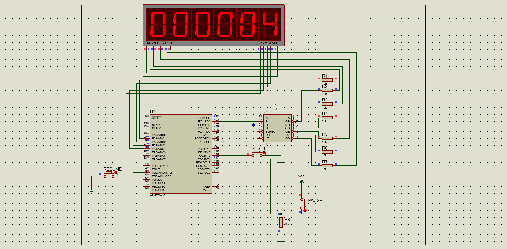

# Stop watch system

## Implemented the following Stop Watch system with the specifications listedbelow:

- Configure Timer1 in ATmega16 with CTC mode to count the Stop Watch time.

- Use six Common Anode 7-segments.
- Connect the six 7-segments in the project using the multiplexed technique. You should use one 7447 decoder for all 7-segments and control the enable/disable for each 7-segement using a NPN BJT transistor connect to one of the MCU pins. Like the multiplexed. Use The common anode decoder 7447 
-  We can connect more than one 7-segment display by using the Multiplexing method. In this method, at a time one 7-segment display is driven by the Microcontroller and the rest are OFF. It keeps switching the displays using transistors. Due to the persistence of vision, it appears as a normal display.
- Connect 7447 decoder 4-pins to the first 4-pins in PORTC.
-Use first 6-pins in PORTA as the enable/disable pins for the six 7-segments.
- Stop Watch counting should start once the power is connected to the MCU.
- Configure External Interrupt INT0 with falling edge. Connect a push button with the
internal pull-up resistor. If a falling edge detected the Stop Watch time should be reset.
- Configure External Interrupt INT1 with raising edge. Connect a push button with the external pull-down resistor. If a raising edge detected the Stop Watch time should be paused.
- Configure External Interrupt INT2 with falling edge. Connect a push button with the
internal pull-up resistor. If a falling edge detected the Stop Watch time should be
resumed.